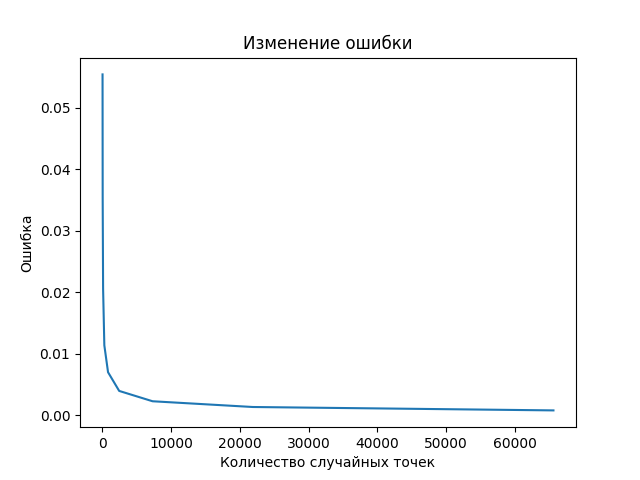

# Лабораторные по мат. анализу
## Установка
Перед запуском необходимо установить зависимости командой `pip install -r requirements.txt`.
## Лабораторная 1
Для запуска нужно написать `python lab1.py`, затем указать количество вершин многоугольника, ввести вершины по одной в строку, указать знаменатель мелкости разбиения.

## Лабораторная 2
Для запуска нужно написать `python lab2.py`, затем аналогичным первой лабораторной образом ввести вершины и указать количество выбираемых случайных точек. В файл `graph.png` будет сохранён график, показывающий изменение ошибки в зависимости количества выбираемых случайных точек.

### Пример графика:
